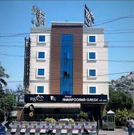
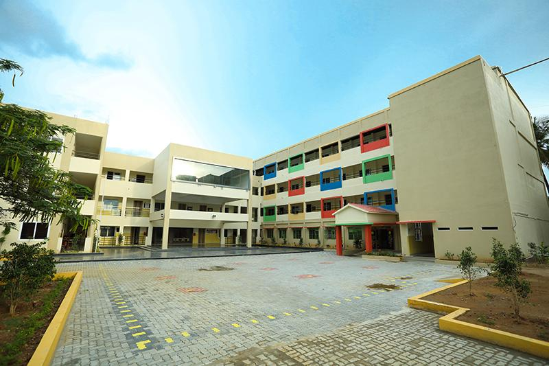
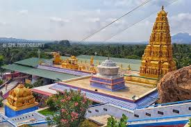

# Ex04 Places Around Me
## Date:11-12-2025

## AIM
To develop a website to display details about the places around my house.

## DESIGN STEPS

### STEP 1
Create a Django admin interface.

### STEP 2
Download your city map from Google.

### STEP 3
Using ```<map>``` tag name the map.

### STEP 4
Create clickable regions in the image using ```<area>``` tag.

### STEP 5
Write HTML programs for all the regions identified.

### STEP 6
Execute the programs and publish them.

## CODE
```
map.html

<!-- Image Map Generated by http://www.image-map.net/ -->


<map name="image-map">
    <area target="" alt="fort" title="fort" href="fort.html" coords="1182,98,1257,155" shape="rect">
    <area target="" alt="kids" title="kids" href="kids.html" coords="654,288,27" shape="circle">
    <area target="" alt="temple" title="temple" href="temple.html" coords="393,382,437,424" shape="rect">
    <area target="" alt="hotel" title="hotel" href="hotel.html" coords="960,282,34" shape="circle">
    <area target="" alt="court" title="court" href="court.html" coords="710,525,759,579" shape="rect">
</map>

court.html

<!DOCTYPE html>
<html>
    <body>
        
    </body>
</html>

fort.html

<!DOCTYPE html>
<html>
    <body>
        
    </body>
</html>

hotel.html

<!DOCTYPE html>
<html>
    <body>
        
    </body>
</html>

kids.html

<!DOCTYPE html>
<html>
    <body>
        
    </body>
</html>

temple.html

<!DOCTYPE html>
<html>
    <body>
        
    </body>
</html>
```

## OUTPUT







## RESULT
The program for implementing image maps using HTML is executed successfully.
